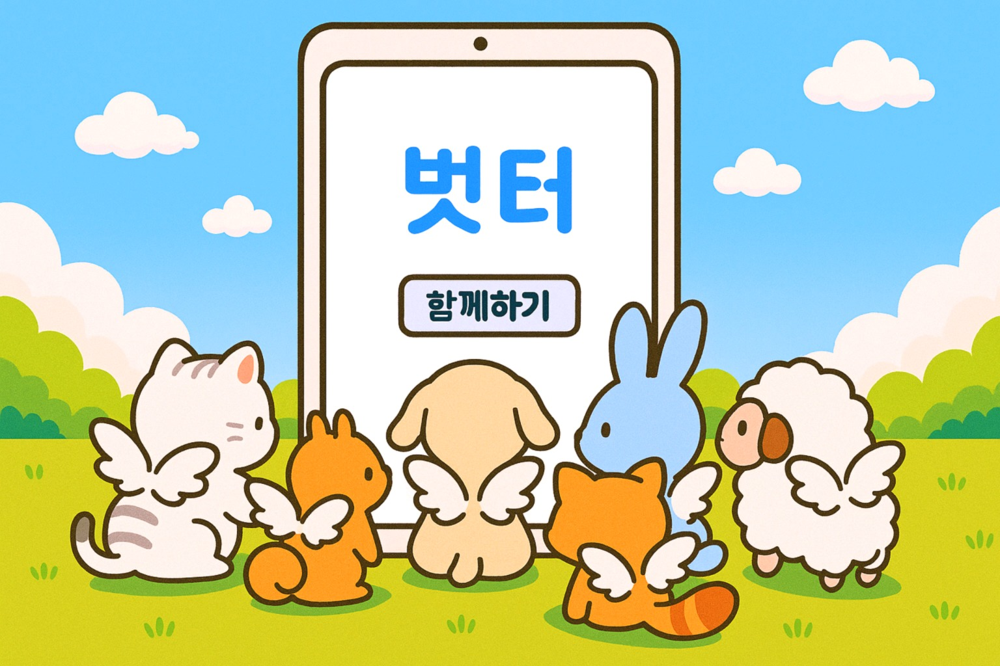
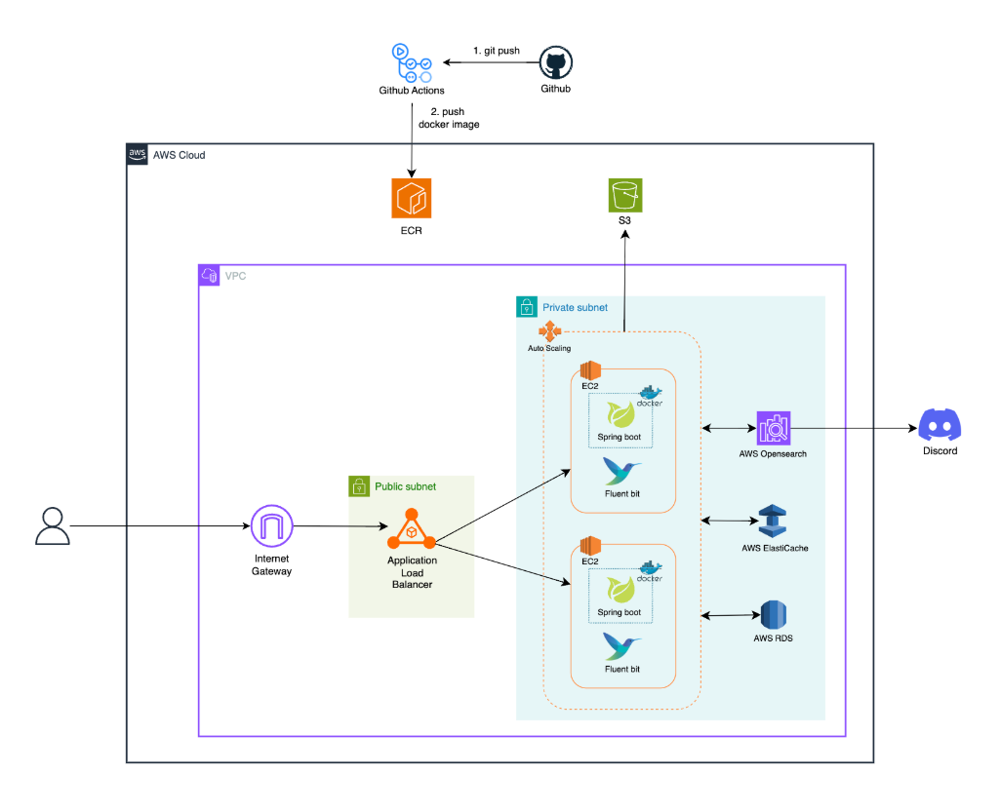
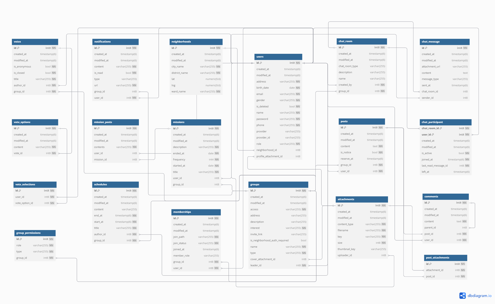

# 🤝 벗터 (Buddy Space)

**벗터**는 친구를 뜻하는 **`벗`** 과 자리/장소를 뜻하는 **`터`** 의 합성어로,  
**친구를 만드는 자리**, **친구와 함께하는 공간**을 의미합니다.

> 바쁜 일상 속에서 관심사가 맞는 친구를 만나고,  
> 관계를 자연스럽게 이어가는 것이 생각보다 쉽지는 않습니다.  
> 벗터는 이런 만남과 관계가 더 쉬워지도록 돕는 커뮤니티 플랫폼입니다.  

<br>

## 📌 서비스 개요

* **누구나 관심사와 성향에 따라** 온라인, 오프라인, 또는 온·오프라인 혼합 형태의 모임을 직접 생성할 수 있습니다.
* **취미, 가족, 학교, 업무, 운동, 게임, 스터디, 팬 활동 등 다양한 주제**의 모임을 탐색하고, 원하는 모임에 가입 요청을 보낼 수 있습니다.
* **초대 링크를 통해 바로 가입**할 수 있어, 친구나 가족이 운영하는 모임에는 승인 없이 빠르고 간편하게 참여할 수 있습니다.
* 가입 요청, 승인/거절, 멤버 차단 및 권한 설정 등 **체계적인 멤버십 관리 기능**을 제공합니다.
* 사진첩, 일정, 미션, 투표, 채팅 등 **풍부한 커뮤니케이션 도구**를 통해 활발한 커뮤니티 활동이 가능합니다.
* 벗터는 내가 원하는 사람들과, 내가 편한 방식으로 자연스럽게 이어질 수 있는 공간을 지향합니다.

<br>

## 🚩 프로젝트 기간

- **진행 기간**: 2025.05.27 ~ 2025.07.07 (6주)
- **1주차**: 주제 선정 및 프로젝트 구조 설계
- **2주차**: 자료 조사 및 기본 기능 구현
- **3주차**: 서버 배포 및 심화 기능 설계
- **4주차**: 심화 기능 구현
- **5주차**: 테스트 화면 구현 및 코드 리팩토링
- **6주차**: 프론트엔드 연동 및 기능 안정화

<br>

## 🛠 기술 스택

 
 
 
 
 
  
 
 
 
 
  
 
 
 
 
 
 
 
  
 
 
 
  

<br>

## 🔗 시스템 설계

- **패키지 구조**

```bash
📦 team.budderz.buddyspace
├── api           # REST API 컨트롤러 계층
├── domain        # 도메인 모델 및 비즈니스 로직
├── infra         # 외부 시스템 연동 및 인프라 구성
│   ├── client    # 외부 API (S3)
│   ├── config    # 인프라 설정
│   ├── database  # JPA Repository
│   └── scheduler # 스케줄링 작업
├── global        # 전역 설정, 예외 처리, 보안, 응답 포맷 등
```

- **Cloud Architecture**  
  

- **ERD**  
  

- **API 문서**
  - [벗터 API 명세서](https://team-budderz.github.io/buddy-space-api/)
  - [Postman 문서](https://documenter.getpostman.com/view/43185152/2sB2xEA8Fu)
  - [WebSocket 채팅 API](https://www.notion.so/WebSocket-API-21dd1de91b88801db74be46dd0d6c9af?pvs=21)
  - [SSE 알림 API](https://www.notion.so/SSE-API-21dd1de91b8880e8ae96ff3ed30bd620?pvs=21)

<br>

## ✨ 주요 기능

### 🔐 인증 / 인가

* 이메일 로그인
* 구글 소셜 로그인
* **JWT** 기반 인증 필터 적용
* **Refresh Token** 저장 및 재발급
* 환경별 **CORS 정책** 설정

### 👤 사용자

* 회원가입
* 로그인
* 회원 정보 조회 / 수정
* 회원 탈퇴

### 🏡 동네

* 현재 위치 기반 동네 인증 (좌표 → 주소 변환 → 동네 등록)
* 사용자의 현재 동네 조회
* 동네 정보 저장 및 관리

### 👥 모임

* 모임 생성 / 수정 / 삭제
* 모임 이름 검색
* 내가 가입한 모임 목록 조회
* 온라인 / 오프라인 모임 목록 조회
* 초대 링크 생성 / 조회 / 삭제 / 가입 처리
* 가입 요청 / 승인 / 거절
* 멤버 강퇴 / 차단 / 차단 해제
* 멤버 목록 조회 (가입 / 요청 / 차단 회원)
* 멤버 권한 설정, 리더 위임
* 기능별 접근 권한 설정 및 조회
* 접근 권한 검증 및 예외 처리
* **공통 권한 검증 컴포넌트** 적용

### 📝 게시글 & 댓글

* 게시글 작성 / 수정 / 삭제
* 예약 게시글 작성 / 수정
* 공지글 작성, 일부 조회, 전체 조회
* 게시글 전체 목록 조회
* 게시글 단건 조회 (댓글 포함)
* 댓글 작성 / 수정 / 삭제
* 대댓글 작성 / 조회

### 🧩 미션 & 인증

* 미션 생성 / 수정 / 삭제
* 미션 목록 조회 / 단건 조회
* 미션 인증글 작성 / 수정 / 삭제
* 인증글 목록 조회 / 단건 조회

### 📆 일정 & 투표

* 일정 생성 / 수정 / 삭제 / 조회
* 투표 생성 / 수정 / 삭제 / 조회
* 투표 참여 / 종료

### 💬 채팅

* 채팅방 생성 / 수정 / 삭제
* 채팅방 목록 / 단건 조회
* 메시지 전송 / 조회 / 삭제
* 채팅방 초대 / 강퇴 / 나가기
* 메시지 읽음 상태 갱신 및 일괄 동기화
* **WebSocket 인증** 및 예외 처리

### 🔔 알림 & SSE

* 알림 저장 / 목록 조회 / 읽음 처리 / 개수 조회
* **SSE** 연결 / Emitter 조회 / 종료 및 삭제

### 📎 첨부파일

* **S3 업로드 / 삭제**
* **Presigned URL** 발급 (조회 / 다운로드용)
* 동영상 썸네일 생성 및 저장
* 첨부파일 메타데이터 저장 및 관리
* 게시글 본문 정제 (data-id 기반), 렌더링 (Presigned URL 삽입)
* 모임 사진첩 기능 (게시글 이미지 / 영상 조회)
* 기본 이미지 Presigned URL 처리 (프로필, 모임 커버)
* 모임 커버 이미지 등록 / 수정 시 적용
* 사용자 프로필 이미지 등록 / 수정 시 적용

### 🚀 배포 & CI/CD

* **AWS EC2** 및 **Elastic IP** 기반 배포 환경 구성
* **Docker Compose** 기반 다중 컨테이너 환경
* **Certbot**을 활용한 SSL 인증서 자동 발급 / 갱신
* **Nginx** 리버스 프록시 및 HTTPS 리다이렉션
* **GitHub Actions** 기반 CI/CD 자동화

### 📡 로그 / 모니터링

* **AOP 기반 요청 로깅**
* **Fluent Bit → OpenSearch** 로그 수집 및 전송
* **Discord Webhook**을 통한 실시간 알림 연동
  
<br>

## 👨‍👩‍👧‍👦 팀 소개

> 내일배움캠프 최종 프로젝트 - **벗터즈 (Budderz)** 팀

| 이름                                       | 역할        | 담당 업무                                                   |
|------------------------------------------|-----------|---------------------------------------------------------|
| [@withong](https://github.com/withong)   | 팀장 / 백엔드  | 모임 생성 및 관리, 모임 멤버 및 권한 관리, 초대 링크 기능, 첨부파일 관리, 테스트 화면 작성 |
| [@exmrim](https://github.com/exmrim)     | 부팀장 / 백엔드 | 인증/인가, 사용자 및 동네 관리, 미션 및 미션 인증 기능                       |
| [@dawn](https://github.com/dawn0920)     | 백엔드       | 게시글 및 댓글 기능, 실시간 알림 기능, 테스트 화면 작성 |
| [@somin](https://github.com/somin-jeong) | 백엔드       | 일정 및 투표 기능, 배포 및 CI/CD 구축, 로그 수집 및 모니터링 |
| [@ssongyi](https://github.com/jrl103)    | 백엔드       | 실시간 채팅 기능, 테스트 화면 작성  |
| [@haneul](https://github.com/haneul02)         | 프론트엔드     | 메인 UI/UX 설계 및 프론트엔드 전반 구현  |

<br>

## 📚 프로젝트 정보

> 본 프로젝트는 **내일배움캠프 Spring 6기 최종 프로젝트**로 진행되었습니다.  
> 프로젝트에 대한 더 자세한 내용은 👉 [브로셔를 참고해주세요.](https://torch-garment-743.notion.site/229fcc3eaffc80fc837ce6a39f774a44)

